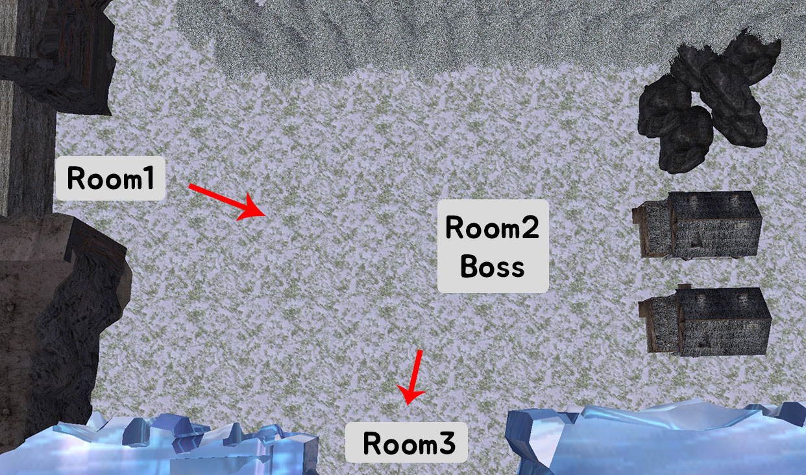
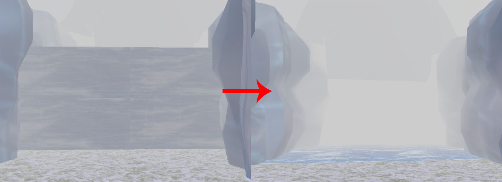
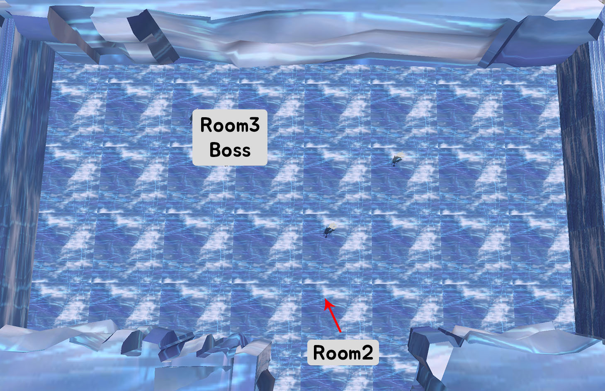

# Portfolio - Game1
- Direct3D 12를 이용한 게임입니다.

## 실행 영상

 

---

## 조작법
### 이동

- 전 후 이동 : W, D
- 좌 우 회전 : A, D
- 질주 : Shift + W

 

### 공격

- 공격은 3가지로 이루어져 있으며 각각 주는 피해량이 다릅니다.
- Punch, Kick, Kick2 로 이루어져 있으며 각각 키보드 숫자키 1, 2, 3 으로 실행이 가능합니다.
- 각각 공격이 진행된 뒤에 남은 쿨타임을 시각적으로 확인할 수 있습니다.

 

---

## UI

- Player의 체력과 스킬, 스킬 남은 시간을 알 수 있습니다.
- Monster의 이름과 체력을 알 수 있습니다.

 

- Player가 죽게되면 Gameover 창이 뜹니다.

 

---

## 시작 방

- 왼쪽에는 나무와 집을 배치하였습니다.
    - 나무는 위치가 조금씩 엇갈리게 랜덤으로 가중치를 주어 배치하였습니다.

- 오른쪽에는 바위와 벽이 있습니다.
    - 벽은 세번째 방과 분리해주도록 만들었습니다.

 

---

## 첫번째 방

- Start 에서 첫번째 방으로 들어오게 되면 <뮤턴트>가 소환됩니다.
- 다른 방의 몬스터에 비해 약하기 때문에 이름은 초록색으로 표시됩니다.

 

### Monster Skill

- (왼쪽 몬스터 기준) 팔을 휘두르는 스킬과 소리지르는 스킬을 사용합니다.

 

### 두번째 방으로 이동

- 초기에는 다음 방으로 이동할 수 없도록 막혀있습니다.
- 첫번째 방의 몬스터를 다 잡게 될 경우 열리게 되며, 이 벽은 세번째 방으로 가는 길을 막게 됩니다.

 

---

## 두번째 방

- 첫번째 방에서 두번째 방으로 들어오게 되면 <워록>이 소환됩니다.
- 몬스터가 보통 수준이기 때문에 이름은 주황색으로 표시됩니다.

 

### Monster Skill

- 팔을 휘두르는 스킬과 주먹질 스킬을 사용합니다.

 

### 세번째 방으로 이동

- 초기에는 다음 방으로 이동할 수 없도록 막혀있습니다.
- 두번째 방의 몬스터를 다 잡게 될 경우 열리게 됩니다.

 

---

## 세번째 방

- 두번째 방에서 세번째 방으로 들어오게 되면 <마우>가 소환됩니다.
- 다른 방의 몬스터에 비해 강하기 때문에 이름은 빨간색으로 표시됩니다.

 

### Monster Skill

- 오른팔을 휘두르는 스킬과 왼팔을 휘두르는 스킬을 사용합니다.

 

---

# 참고 

- 3D Models and Animation Data
    - [Mixamo](https://www.mixamo.com/#/)
    - [Turbosquid](https://www.turbosquid.com)
        - [House](https://www.turbosquid.com/FullPreview/Index.cfm/ID/689373)
        - [Rocks1](https://www.turbosquid.com/FullPreview/Index.cfm/ID/1074560), [Rocks2](https://www.turbosquid.com/FullPreview/Index.cfm/ID/1048945)
        - [Canyon](https://www.turbosquid.com/FullPreview/Index.cfm/ID/744445)
        - [Tree](https://www.turbosquid.com/FullPreview/Index.cfm/ID/480733)
        
- Font
    - [배달의민족 주아체](http://font.woowahan.com/jua/)
